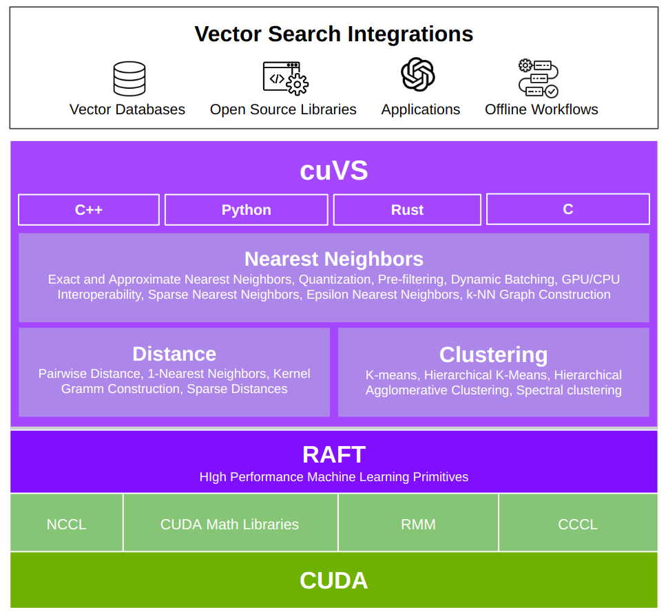

# <div align="left">&nbsp;cuVS: Vector Search and Clustering on the GPU</div>


## Contents

1. [Useful Resources](#useful-resources)
2. [What is cuVS?](#what-is-cuvs)
3. [Installing cuVS](#installing-cuvs)
4. [Getting Started](#getting-started)
5. [Contributing](#contributing)
6. [References](#references)

## Useful Resources

- [Documentation](https://docs.rapids.ai/api/cuvs/nightly/): Library documentation.
- [Build and Install Guide](https://docs.rapids.ai/api/cuvs/nightly/build): Instructions for installing and building cuVS.
- [Getting Started Guide](https://docs.rapids.ai/api/cuvs/nightly/getting_started): Guide to getting started with cuVS.
- [Code Examples](https://github.com/rapidsai/cuvs/tree/HEAD/examples): Self-contained Code Examples.
- [API Reference Documentation](https://docs.rapids.ai/api/cuvs/nightly/api_docs): API Documentation.
- [RAPIDS Community](https://rapids.ai/community.html): Get help, contribute, and collaborate.
- [GitHub repository](https://github.com/rapidsai/cuvs): Download the cuVS source code.
- [Issue tracker](https://github.com/rapidsai/cuvs/issues): Report issues or request features.

## What is cuVS?

cuVS contains state-of-the-art implementations of several algorithms for running approximate nearest neighbors and clustering on the GPU. It can be used directly or through the various databases and other libraries that have integrated it. The primary goal of cuVS is to simplify the use of GPUs for vector similarity search and clustering.

Vector search is an information retrieval method that has been growing in popularity over the past few  years, partly because of the rising importance of multimedia embeddings created from unstructured data and the need to perform semantic search on the embeddings to find items which are semantically similar to each other.

Vector search is also used in _data mining and machine learning_ tasks and comprises an important step in many _clustering_ and _visualization_ algorithms like [UMAP](https://arxiv.org/abs/2008.00325), [t-SNE](https://lvdmaaten.github.io/tsne/), K-means, and [HDBSCAN](https://hdbscan.readthedocs.io/en/latest/how_hdbscan_works.html).

Finally, faster vector search enables interactions between dense vectors and graphs. Converting a pile of dense vectors into nearest neighbors graphs unlocks the entire world of graph analysis algorithms, such as those found in [GraphBLAS](https://graphblas.org/) and [cuGraph](https://github.com/rapidsai/cugraph).

Below are some common use-cases for vector search


- ### Semantic search
  - Generative AI & Retrieval augmented generation (RAG)
  - Recommender systems
  - Computer vision
  - Image search
  - Text search
  - Audio search
  - Molecular search
  - Model training


- ### Data mining
  - Clustering algorithms
  - Visualization algorithms
  - Sampling algorithms
  - Class balancing
  - Ensemble methods
  - k-NN graph construction

## Why cuVS?

There are several benefits to using cuVS and GPUs for vector search, including

1. Fast index build
2. Latency critical and high throughput search
3. Parameter tuning
4. Cost savings
5. Interoperability (build on GPU, deploy on CPU)
6. Multiple language support
7. Building blocks for composing new or accelerating existing algorithms

In addition to the items above, cuVS shoulders the burden of keeping non-trivial accelerated code up to date as new NVIDIA architectures and CUDA versions are released. This provides a delightful development experience, guaranteeing that any libraries, databases, or applications built on top of it will always be getting the best performance and scale.

## cuVS Technology Stack

cuVS is built on top of the RAPIDS RAFT library of high performance machine learning primitives and provides all the necessary routines for vector search and clustering on the GPU.




## Installing cuVS

cuVS comes with pre-built packages that can be installed through [conda](https://conda.io/projects/conda/en/latest/user-guide/getting-started.html#managing-python) and [pip](https://pip.pypa.io/en/stable/). Different packages are available for the different languages supported by cuVS:

| Python | C/C++     |
|--------|-----------|
| `cuvs` | `libcuvs` |

### Stable release

It is recommended to use [mamba](https://conda.github.io/conda-libmamba-solver/user-guide/) to install the desired packages. The following command will install the Python package. You can substitute `cuvs` for any of the packages in the table above:

```bash
conda install -c rapidsai -c conda-forge cuvs
```

The cuVS Python package can also be installed through [pip](https://docs.rapids.ai/install#pip>).

```bash
# CUDA 13
pip install cuvs-cu13 --extra-index-url=https://pypi.nvidia.com

# CUDA 12
pip install cuvs-cu12 --extra-index-url=https://pypi.nvidia.com
```

### Nightlies
If installing a version that has not yet been released, the `rapidsai` channel can be replaced with `rapidsai-nightly`:

```bash
# CUDA 13
conda install -c rapidsai-nightly -c conda-forge cuvs=26.04 cuda-version=13.1

# CUDA 12
conda install -c rapidsai-nightly -c conda-forge cuvs=26.04 cuda-version=12.9
```

> [!NOTE]
> If compiled binary size is a concern, please note that the cuVS builds for CUDA 13 are roughly half the size of CUDA 12 builds. This is a result of improved compression rates in the newer supported CUDA drivers. We will be adopting the newer drivers for CUDA 12 builds in Spring of 2026, which will ultimately bring them down to roughly the size of the CUDA 13 builds. In the meantime, the NVIDIA cuVS team is continuing to shave down the binary sizes for all supported CUDA versions. If binary size is an issue for you, please consider linking to cuVS statically either by building from source or using pre-built `libcuvs-static` conda package.

Please see the [Build and Install Guide](https://docs.rapids.ai/api/cuvs/nightly/build/) for more information on installing the available cuVS packages and building from source.

## Getting Started

The following code snippets train an approximate nearest neighbors index for the CAGRA algorithm in the various different languages supported by cuVS.

### Python API

```python
from cuvs.neighbors import cagra

dataset = load_data()
index_params = cagra.IndexParams()

index = cagra.build(build_params, dataset)
```

### C++ API

```c++
#include <cuvs/neighbors/cagra.hpp>

using namespace cuvs::neighbors;

raft::device_matrix_view<float> dataset = load_dataset();
raft::device_resources res;

cagra::index_params index_params;

auto index = cagra::build(res, index_params, dataset);
```

For more code examples of the C++ APIs, including drop-in Cmake project templates, please refer to the [C++ examples](https://github.com/rapidsai/cuvs/tree/HEAD/examples) directory in the codebase.

### C API

```c
#include <cuvs/neighbors/cagra.h>

cuvsResources_t res;
cuvsCagraIndexParams_t index_params;
cuvsCagraIndex_t index;

DLManagedTensor *dataset;
load_dataset(dataset);

cuvsResourcesCreate(&res);
cuvsCagraIndexParamsCreate(&index_params);
cuvsCagraIndexCreate(&index);

cuvsCagraBuild(res, index_params, dataset, index);

cuvsCagraIndexDestroy(index);
cuvsCagraIndexParamsDestroy(index_params);
cuvsResourcesDestroy(res);
```

For more code examples of the C APIs, including drop-in Cmake project templates, please refer to the [C examples](https://github.com/rapidsai/cuvs/tree/main/examples/c)

### Rust API

```rust
use cuvs::cagra::{Index, IndexParams, SearchParams};
use cuvs::{ManagedTensor, Resources, Result};

use ndarray::s;
use ndarray_rand::rand_distr::Uniform;
use ndarray_rand::RandomExt;

/// Example showing how to index and search data with CAGRA
fn cagra_example() -> Result<()> {
    let res = Resources::new()?;

    // Create a new random dataset to index
    let n_datapoints = 65536;
    let n_features = 512;
    let dataset =
        ndarray::Array::<f32, _>::random((n_datapoints, n_features), Uniform::new(0., 1.0));

    // build the cagra index
    let build_params = IndexParams::new()?;
    let index = Index::build(&res, &build_params, &dataset)?;
    println!(
        "Indexed {}x{} datapoints into cagra index",
        n_datapoints, n_features
    );

    // use the first 4 points from the dataset as queries : will test that we get them back
    // as their own nearest neighbor
    let n_queries = 4;
    let queries = dataset.slice(s![0..n_queries, ..]);

    let k = 10;

    // CAGRA search API requires queries and outputs to be on device memory
    // copy query data over, and allocate new device memory for the distances/ neighbors
    // outputs
    let queries = ManagedTensor::from(&queries).to_device(&res)?;
    let mut neighbors_host = ndarray::Array::<u32, _>::zeros((n_queries, k));
    let neighbors = ManagedTensor::from(&neighbors_host).to_device(&res)?;

    let mut distances_host = ndarray::Array::<f32, _>::zeros((n_queries, k));
    let distances = ManagedTensor::from(&distances_host).to_device(&res)?;

    let search_params = SearchParams::new()?;

    index.search(&res, &search_params, &queries, &neighbors, &distances)?;

    // Copy back to host memory
    distances.to_host(&res, &mut distances_host)?;
    neighbors.to_host(&res, &mut neighbors_host)?;

    // nearest neighbors should be themselves, since queries are from the
    // dataset
    println!("Neighbors {:?}", neighbors_host);
    println!("Distances {:?}", distances_host);
    Ok(())
}
```

For more code examples of the Rust APIs, including a drop-in project templates, please refer to the [Rust examples](https://github.com/rapidsai/cuvs/tree/main/examples/rust).

## Contributing

If you are interested in contributing to the cuVS library, please read our [Contributing guidelines](docs/source/contributing.md). Refer to the [Developer Guide](docs/source/developer_guide.md) for details on the developer guidelines, workflows, and principles.

## References

For the interested reader, many of the accelerated implementations in cuVS are also based on research papers which can provide a lot more background. We also ask you to please cite the corresponding algorithms by referencing them in your own research.
- [CAGRA: Highly Parallel Graph Construction and Approximate Nearest Neighbor Search](https://arxiv.org/abs/2308.15136)
- [Top-K Algorithms on GPU: A Comprehensive Study and New Methods](https://dl.acm.org/doi/10.1145/3581784.3607062)
- [Fast K-NN Graph Construction by GPU Based NN-Descent](https://dl.acm.org/doi/abs/10.1145/3459637.3482344?casa_token=O_nan1B1F5cAAAAA:QHWDEhh0wmd6UUTLY9_Gv6c3XI-5DXM9mXVaUXOYeStlpxTPmV3nKvABRfoivZAaQ3n8FWyrkWw>)
- [cuSLINK: Single-linkage Agglomerative Clustering on the GPU](https://arxiv.org/abs/2306.16354)
- [GPU Semiring Primitives for Sparse Neighborhood Methods](https://arxiv.org/abs/2104.06357)
