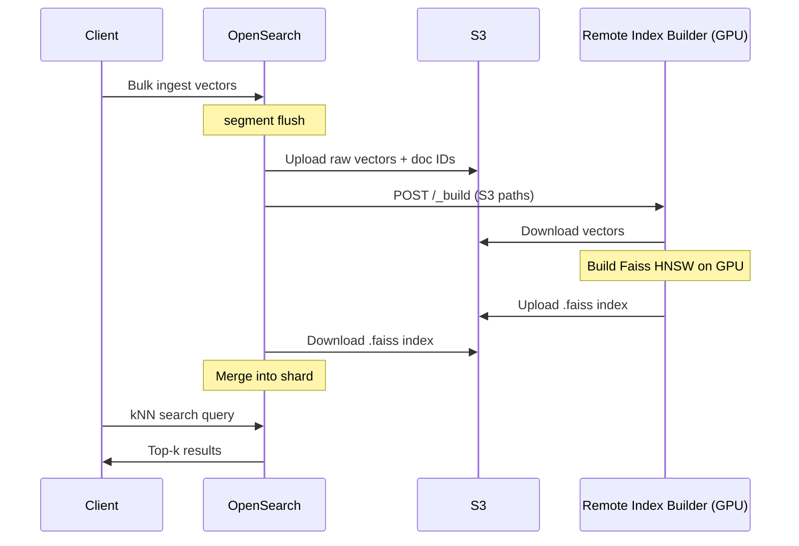

# OpenSearch GPU Remote Index Build — Deployment Guide

This guide walks through running OpenSearch with GPU-accelerated vector index construction using the [remote index build service](https://docs.opensearch.org/latest/vector-search/remote-index-build/). When enabled, OpenSearch offloads Faiss HNSW index building to a dedicated GPU service rather than building indexes in-process on the data nodes.

## How it works

The GPU build is triggered automatically during normal ingest — no changes to your indexing workflow are required beyond the one-time cluster and index configuration described below.



## Services

| Service | Image | Purpose |
|---|---|---|
| `opensearch` | custom build of `opensearchproject/opensearch:3.6.0` | OpenSearch node with kNN plugin and `repository-s3` plugin |
| `remote-index-builder` | `opensearchproject/remote-vector-index-builder:api-latest` | GPU-accelerated Faiss HNSW index builder |

The custom OpenSearch image adds the `repository-s3` plugin (required for S3-backed vector staging) and populates the S3 keystore from environment variables at startup so credentials are never baked into image layers.

## Requirements

- **Docker Compose v2**
- **NVIDIA GPU** with CUDA support
- **NVIDIA Container Toolkit** — [installation guide](https://docs.nvidia.com/datacenter/cloud-native/container-toolkit/install-guide.html)
- **AWS S3 bucket** for staging vectors during the build

## Setup

Set the host kernel parameter required by OpenSearch (once per reboot):

```bash
sudo sysctl -w vm.max_map_count=262144
```

Set required environment variables:

```bash
export S3_BUCKET=<your-s3-bucket>
export AWS_ACCESS_KEY_ID=<access-key-id>
export AWS_SECRET_ACCESS_KEY=<secret-access-key>
```

Optionally configure the region and session token for temporary credentials:

```bash
export AWS_DEFAULT_REGION=us-east-1        # default: us-east-1
export AWS_SESSION_TOKEN=<session-token>   # required for temporary (STS) credentials
```

Start OpenSearch and the GPU builder:

```bash
docker compose --profile gpu up --build -d --wait opensearch remote-index-builder
```

## Connecting OpenSearch to the GPU builder

Before any index can use GPU builds, you need to register your S3 bucket as a snapshot repository and apply the cluster settings that point OpenSearch at the builder service. Run these once against a live cluster.

**Register S3 repository:**

```bash
curl -X PUT http://localhost:9200/_snapshot/<your-s3-bucket> \
  -H "Content-Type: application/json" \
  -d '{
    "type": "s3",
    "settings": {
      "bucket": "<your-s3-bucket>",
      "base_path": "knn-indexes",
      "region": "us-east-1"
    }
  }'
```

**Apply cluster settings:**

```bash
curl -X PUT http://localhost:9200/_cluster/settings \
  -H "Content-Type: application/json" \
  -d '{
    "persistent": {
      "knn.remote_index_build.enabled": true,
      "knn.remote_index_build.repository": "<your-s3-bucket>",
      "knn.remote_index_build.service.endpoint": "http://remote-index-builder:1025"
    }
  }'
```

> **Note:** `remote-index-builder` resolves inside the Docker network. If OpenSearch and the builder are not on the same Docker network, replace this with a reachable hostname or IP.

## Creating an index with GPU builds enabled

Add `"index.knn.remote_index_build.enabled": true` to your index settings alongside the standard kNN configuration:

```bash
curl -X PUT http://localhost:9200/my-vectors \
  -H "Content-Type: application/json" \
  -d '{
    "settings": {
      "index.knn": true,
      "index.knn.remote_index_build.enabled": true,
      "number_of_shards": 1,
      "number_of_replicas": 1
    },
    "mappings": {
      "properties": {
        "vector": {
          "type": "knn_vector",
          "dimension": 256,
          "method": {
            "name": "hnsw",
            "engine": "faiss",
            "space_type": "l2",
            "parameters": {
              "m": 32,
              "ef_construction": 512
            }
          }
        }
      }
    }
  }'
```

GPU builds are only available with the `faiss` engine. The `lucene` engine always builds locally.

## Verifying the GPU build

The `remote-index-build/` directory contains an end-to-end demo script that ingests 200,000 random vectors, triggers a force-merge, and confirms the GPU build completed by polling S3 for the resulting `.faiss` file.

Run it inside a temporary container on the same Docker network:

```bash
docker compose run --rm \
  -e OPENSEARCH_URL=http://opensearch:9200 \
  -e BUILDER_URL=http://remote-index-builder:1025 \
  -e S3_BUCKET=${S3_BUCKET} \
  -e AWS_ACCESS_KEY_ID=${AWS_ACCESS_KEY_ID} \
  -e AWS_SECRET_ACCESS_KEY=${AWS_SECRET_ACCESS_KEY} \
  -e AWS_SESSION_TOKEN=${AWS_SESSION_TOKEN} \
  -e AWS_DEFAULT_REGION=${AWS_DEFAULT_REGION:-us-east-1} \
  -v $(pwd)/remote-index-build:/app/remote-index-build \
  --no-deps bench \
  python remote-index-build/run.py
```

Or run it directly if you have Python and the dependencies installed locally (`boto3`, `numpy`, `requests`), pointing `OPENSEARCH_URL` at `http://localhost:9200`.

A successful run prints a `.faiss` file path in S3 and returns top-10 nearest-neighbor results.

## Tearing down

```bash
docker compose --profile gpu down -v
```

The `-v` flag removes the OpenSearch data volume. Omit it to preserve indexed data across restarts.

## Production considerations

This setup is a working demonstration, not a production-hardened deployment. Key differences to address before running in production:

- **Security plugin**: `opensearch.yml` has `plugins.security.disabled: true`. Re-enable it and configure TLS and authentication for any non-local deployment.
- **Single-node cluster**: `discovery.type: single-node` bypasses multi-node bootstrap checks. Replace with a properly configured multi-node cluster for production.
- **Replicas**: The demo uses `number_of_replicas: 0`. Set this to at least `1` for production workloads.
- **S3 permissions**: The IAM credentials need `s3:GetObject`, `s3:PutObject`, `s3:ListBucket`, and `s3:DeleteObject` on the staging bucket.

## Ports

| Port | Service |
|---|---|
| `9200` | OpenSearch REST API |
| `1025` | Remote index builder API |
