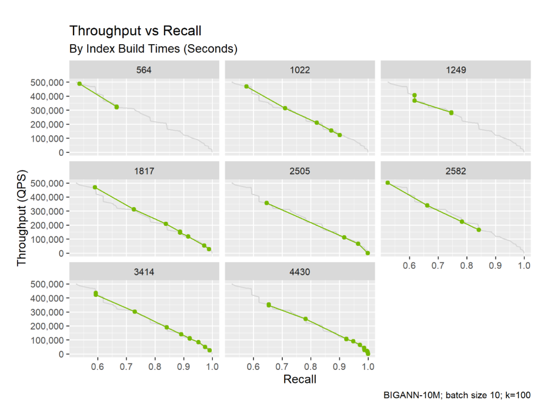
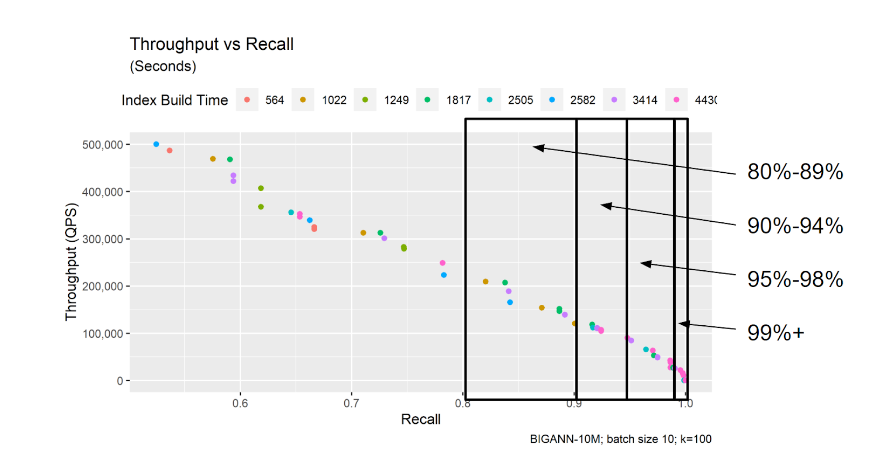
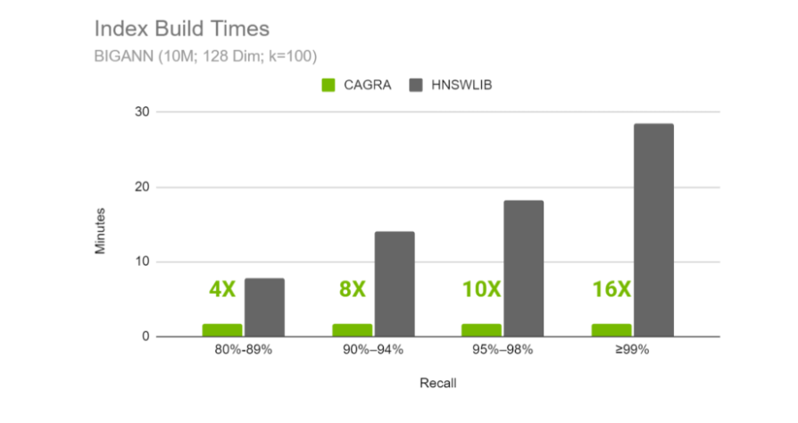

.. _comparing_indexes:

~~~~~~~~~~~~~~~~~~~~~~~~~~~~~~~~~~~~~~~
Comparing performance of vector indexes
~~~~~~~~~~~~~~~~~~~~~~~~~~~~~~~~~~~~~~~

This document provides a brief overview methodology for comparing vector search indexes and models. For guidance on how to choose and configure an index type, please refer to :doc:`this <vector_databases_vs_vector_search>` guide.

Unlike traditional database indexes, which will generally return correct results even without performance tuning, vector search indexes are more closely related to ML models and they can return absolutely garbage results if they have not been tuned.

For this reason, it’s important to consider the parameters that an index is built upon, both for its potential quality and throughput/latency, when comparing two trained indexes. While easier to build an index on its default parameters than having to tune them, a well tuned index can have a significantly better search quality AND perform within search perf constraints like maximal throughput and minimal latency.

What is recall?
===============

Recall is a measure of model quality. Imagine for a particular vector, we know the exact nearest neighbors because we computed them already. The recall for a query result can be computed by taking the set intersection between the exact nearest neighbors and the actual nearest neighbors. The number of neighbors in that intersection list gets divided by k, the number of neighbors being requested. To really give a fair estimate of the recall of a model, we use several query vectors, all with ground truth computed, and we take the total neighbors across all intersected neighbor lists and divide by n_queries * k.

Parameter settings dictate the quality of an index. The graph below shows eight indexes from the same data but with different tuning parameters. Generally speaking, the indexes with higher average recall took longer to build. Which index is fair to report?

How do I compare models or indexing algorithms?
===============================================

In order to fairly compare the performance (e.g. latency and throughput) of an indexing algorithm or model against another, we always need to do so with respect to its potential recall. This is important and draws from the ML roots of vector search, but is often confusing to newcomers who might be more familiar with the database world.

Best practice: Latency and throughput can only be compared at similar levels of recall. If you measure the performance of two indexes at different levels of recall, you are making an unfair comparison.

Because recall levels can vary quite a bit across parameter settings, we tend to compare recall within a small set of potential buckets, so that parameter settings that perform within each bucket can be fairly compared.

We suggest averaging performance within a range of recall. For general guidance, we tend to use the following buckets:

#. 85% - 89%
#. 90% - 94%
#. 95% - 99%
#. >99%

This allows us to make observations such as “at 95% recall level, model A can be built 3x faster than model B, but model B has 2x lower latency than model A”

Another important detail is that we compare these models against their best-case search performance within each recall window. This means that we aim to find models that not only have great recall quality but also have either the highest throughput or lowest latency within the window of interest. These best-cases are most often computed by doing a parameter sweep in a grid search (or other types of search optimizers) and looking at the best cases for each level of recall.

The resulting data points will construct a curve known as a Pareto optimum. Please note that this process is specifically for showing best-case across recall and throughput/latency, but when we care about finding the parameters that yield the best recall and search performance, we are essentially performing a  hyperparameter optimization, which is common in machine learning.

How do I do this on large vector databases?
===========================================

It turns out that most vector databases, like Milvus for example, make many smaller vector search indexing models for a single “index”, and the distribution of the vectors across the smaller index models are assumed to be completely uniform. This means we can use subsampling to our benefit, and tune on smaller sub-samples of the overall dataset.

Please note, however, that there are often caps on the size of each of these smaller indexes, and that needs to be taken into consideration when choosing the size of the sub sample to tune.

Please see :doc:`this guide <tuning_guide>` for more information on the steps one would take to do this subsampling and tuning process.
