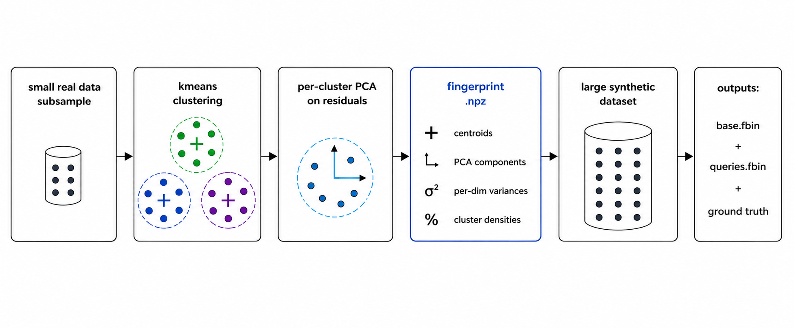
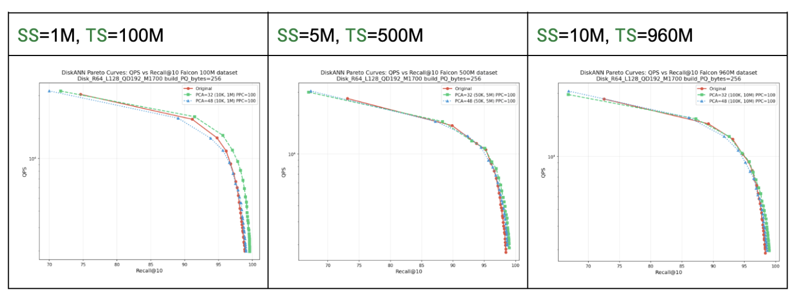
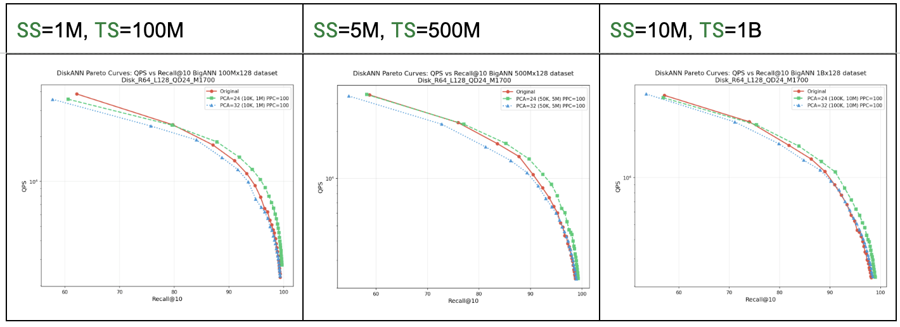
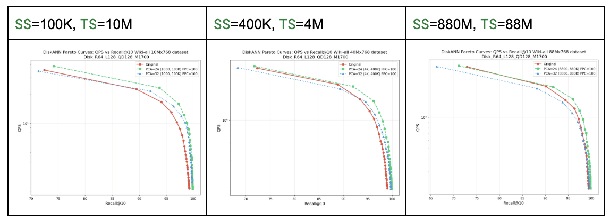

# `cuvs_bench.synthesize_dataset`

Generates a synthetic dataset of arbitrary size from a small sample of a real dataset, for benchmarking vector indexes at scales (100M, 1B, 10B+) where the real dataset isn't available at the target size. Purely random vectors aren't a substitute — the clustering structure, neighbor density, and intrinsic dimensionality of real embeddings are what dominate ANN index behavior, and random data has none of those.

The synthetic dataset approximates the real dataset's behavior under ANN search rather than its raw vector content. When you build the same index on both and sweep the same search-effort knob (CAGRA's `itopk_size`, HNSW's `efSearch`, DiskANN's `L`, …), the recall–throughput Pareto curves track each other and relative algorithm rankings carry over.

Ground truth is generated alongside the data and can be computed at any target size without storing the full dataset on disk. See [How it works](#how-it-works) for the mechanism.


# When to use this

Use it when:

- You want to benchmark a vector index at 100M / 1B / 10B+ but only have a small (~10M) real dataset.
- You want benchmark numbers (recall, throughput, build time) on the synthetic data that **carry over** to what you'd see on the real data at the same scale.
- The real dataset is sensitive or proprietary and can't be shared, but you want a collaborator (or vendor) to benchmark a vector index against something representative of it. Fit a fingerprint locally and share that small file (.npz) instead of the dataset — it stores only per-cluster aggregate statistics, never raw rows. The collaborator regenerates the synthetic dataset locally. See [How it works](#how-it-works) for what's in the fingerprint.

**Don't** use it when:

- You want to use the data for anything other than ANN-index benchmarking — training or fine-tuning embedding models, evaluating downstream ML tasks, distance-correctness tests against a real reference, or any workload that depends on the *actual vector content*. The synthetic vectors only preserve index-search behavior; they aren't a substitute for the real dataset in any other context.

# How it works



The `fit` step learns the small fingerprint highlighted in blue above. The `generate` step turns the fingerprint into a synthetic dataset of arbitrary size, and ground truth is computed alongside it: each query probes its `nprobes` nearest clusters, those clusters are regenerated deterministically from the fingerprint, and brute-force k-NN is run against just those candidates. This is what makes 10B+ scale GT tractable. Note that `nprobes` here is an internal parameter of the GT pipeline (how many clusters we probe to find true neighbors), not a search-time parameter of any specific ANN index.

### What the fingerprint contains

The `fit` step produces a single NPZ file holding only per-cluster aggregate statistics:

- `centroids` — means over each cluster's points.
- `pca_components_arr` — eigenvectors of the per-cluster residual covariance (linear functionals of the cluster, not raw rows).
- `pca_explained_var_arr`, `pca_noise_var` — eigenvalues and residual variance scalars.
- `pca_n_components` — the requested number of PCA components.
- `variances_per_dim` — per-dim variance per cluster.
- `densities` — per-cluster point counts, normalized.
- `norm_unit` — single bool: whether the fit-time input was (≈) L2-unit-norm.
- `norm_quantiles` — per-cluster norm inverse-CDF: a `(n_clusters, 256)` grid of the real vector-norm distribution within each cluster. At generate time each vector draws a target norm from its cluster's grid (inverse-CDF sampling), so the synthetic data reproduces each cluster's real *radial spread*.

No individual row of the original data is stored anywhere in the fingerprint, and the synthetic data emitted at generate-time is `centroid + RNG`, never a copy of a real row.

### Query generation (random jitter)

Queries are sampled from the dataset itself and perturbed with a small Gaussian, so they sit on the data manifold without being exact-match copies of database rows. The `generate` step produces them automatically alongside `base.fbin` and GT.

If you also have the real dataset and want matching queries on it (e.g. for the synth-vs-real comparison in Step 7), run `cuvs_bench.generate_groundtruth --queries random-jitter` on it.

# Requirements

- `cuvs` (already a dependency of cuvs-bench) — provides KMeans, PCA, and brute-force k-NN.
- `cupy`, `numpy`, `tqdm`.
- A GPU. CPU-only operation isn't supported.

# Step-by-step

### Step 1 — Pick `sample_size`, `n_clusters`, and `ncomp`

Two raw sizes feed the recipe:

- **`total_rows`** — target size of the synthetic dataset you want to generate (e.g. 100M, 1B, 10B etc).
- **`sample_size`** — size of the real-data slice you fit the fingerprint on (passed to `fit`).

Three knobs are derived from (or chosen alongside) those:

- **SF** (scale factor) = `total_rows / sample_size` — how much we stretch the fitting sample to reach the target size.
- **PPC** (points per cluster) = `sample_size / n_clusters` — average number of real sample points per KMeans cluster.
- **`ncomp`** — number of PCA components fit per cluster, i.e. the rank of the low-rank Gaussian sampler used to draw synthetic points around each centroid.

Use the recommended defaults: **SF=100, PPC=100, `ncomp=32`**. With those fixed, the only thing you choose is the **target size**, and everything else follows mechanically:

```text
sample_size = target_size / 100        # SF = target_size / sample_size = 100
n_clusters  = sample_size / 100        # PPC = sample_size / n_clusters  = 100
ncomp       = 32                       # good middle ground at PPC=100
```

So for a 100M target: `sample_size=1M`, `n_clusters=10K`, `ncomp=32`. For a 1B target: `sample_size=10M`, `n_clusters=100K`, `ncomp=32`.

`ncomp=32` is the default because it sits in the empirical sweet spot at PPC=100 — large enough to capture the dominant intra-cluster correlations on typical embedding data, small enough to estimate reliably with 100 points per cluster. Above the ceiling listed below, recall degrades uniformly across the entire recall range; below ~16 the model is under-expressive at large target sizes.

| Embedding dim         | `ncomp` ceiling | Recommended `ncomp` |
|-----------------------|-----------------|---------------------|
| 1024d (e.g. Falcon)   | ~48             | 32                  |
| 768d (e.g. Wiki)      | ~32             | 32                  |
| 128d (e.g. BigANN)    | ~32             | 24                  |


### Step 2 — Fit the cluster fingerprint

```bash
python -m cuvs_bench.synthesize_dataset fit \
    --dataset /path/to/your_real_data.fbin \
    --sample_size 1000000 \
    --n_clusters 10000 \
    --pca_components 32 \
    --output fingerprint.npz
```

The output `fingerprint.npz` can be reused for any target size.

Supported input formats: `.fbin` (cuvs-bench layout), `.npy`, `.pkl`.

### Step 3 — (Recommended) Verify `nprobes` at small scale

`nprobes` is how many nearest clusters each ground-truth query probes when computing GT. We don't search the whole synthetic dataset for each query — that would be O(`total_rows`) per query and takes long at multi-billion scale. Instead, for each query we re-generate only the `nprobes` clusters whose centroids are closest to the query and run brute-force k-NN against just those points.

By construction `nprobes ≤ n_clusters` (probing more clusters than exist is meaningless). **Recommended starting point: `nprobes ≈ 5% of n_clusters`.** For the fit recipe in Step 1 (`n_clusters=10K` at 100M targets, `100K` at 1B), that lands at `nprobes=500` and `5000` respectively. Empirically this keeps Step 3's recall above 0.999, i.e. the cheap nprobe GT and the exact GT agree on more than 99.9% of true neighbors. Higher `nprobes` is more accurate but linearly more expensive at GT time.

> **What "recall" means in this step.** The recall reported by `verify` is *internal to the GT pipeline* — it measures how well the cheap nprobe GT agrees with the exact streaming GT. It is **not** the recall of any ANN index you'll later benchmark on the synthetic data.

**`nprobes` requirements *shrink* with `total_rows`, not grow.** A fingerprint has a fixed `n_clusters`, so at larger `total_rows` each cluster holds proportionally more points (same `densities`, just more samples each). For a fixed `k`, a query's top-`k` true neighbors then concentrate in *fewer* nearby clusters than they would at a smaller scale — both because each cluster contributes more candidates and because the k-th nearest distance shrinks as overall density grows. So an `nprobes` calibrated at a small `total_rows` is a **safe upper bound** for the same fingerprint at larger target sizes — it can only over-probe at the larger scale, never under-probe.

Before paying for the full-scale generation, run the cheap nprobe GT against the exact streaming GT at a small `total_rows` and check that they agree:

```bash
python -m cuvs_bench.synthesize_dataset verify \
    --fingerprint fingerprint.npz \
    --total_rows 1000000 \
    --n_queries 1000 \
    --k 10 \
    --nprobes 500            # ~5% of n_clusters=10K
```

If GT-vs-GT recall ≥ 0.999, that `nprobes` is safe to reuse in Step 4 at any larger `total_rows` — Step 3 conservatively over-estimates what you actually need at scale, so the value carries over without re-tuning. If recall is lower, bump `nprobes` and re-run Step 3 (cheap).

### Step 4 — Generate the synthetic dataset + queries + GT

#### **Option 1 (Fast path): nprobe GT.**
Uses the `nprobes` you settled on in Step 3 — only the `nprobes` clusters nearest each query are regenerated and brute-forced. As mentioned in the previous step, using about 5% of `n_clusters` is a good heuristic to reach ≥ 0.999.

```bash
python -m cuvs_bench.synthesize_dataset generate \
    --fingerprint fingerprint.npz \
    --total_rows 1000000000 \
    --n_queries 10000 \
    --k 10 \
    --nprobes 500 \
    --gt_mode nprobe \
    --output_dir synthetic_100M/
```

#### **Option 2 (Exact path, slower): exact GT.**
Set `--gt_mode exact` for exact GT — every cluster is regenerated on the GPU and brute-forced against the queries. Slower than the nprobe path, but still faster than a standard GT computation at the same `total_rows` because there's no disk I/O or host↔device transfer of the dataset.

```bash
python -m cuvs_bench.synthesize_dataset generate \
    --fingerprint fingerprint.npz \
    --total_rows 1000000000 \
    --n_queries 10000 \
    --k 10 \
    --gt_mode exact \
    --output_dir synthetic_100M/
```

Outputs (cuvs-bench-compatible):

- `synthetic_100M/base.fbin`
- `synthetic_100M/queries.fbin`
- `synthetic_100M/groundtruth.neighbors.ibin`
- `synthetic_100M/groundtruth.distances.fbin`

> **Disk-size note.** `base.fbin` is materialized to disk at full `total_rows × ncols × 4` bytes. Make sure `--output_dir` lives on a volume with enough free space before kicking off a large run. Generation streams cluster-by-cluster directly to disk, so host RAM stays bounded (~a few GB) regardless of `total_rows` — only the disk volume matters.

### Step 5 — Register the synthetic dataset for `cuvs_bench.run`

`cuvs_bench.run` resolves datasets by **name** from a YAML registry and expects a directory layout where each dataset lives in its own subdirectory under a common `--dataset-path`. Drop the `synthetic_100M/` directory you just produced under whatever you use as your dataset root, and add a YAML entry that points at it.

**1. Lay out the files** so `--dataset-path` is the parent:

```text
$RAPIDS_DATASET_ROOT_DIR/
└── my_real_data_synth_100M/            # ← synthetic, produced in Step 4
    ├── base.fbin
    ├── queries.fbin
    ├── groundtruth.neighbors.ibin
    └── groundtruth.distances.fbin
```

**2. Register the dataset** in a YAML file (`my_datasets.yaml`):

```yaml
- name: my_real_data_synth_100M
  dims: 768
  distance: euclidean
  base_file: my_real_data_synth_100M/base.fbin
  query_file: my_real_data_synth_100M/queries.fbin
  groundtruth_neighbors_file: my_real_data_synth_100M/groundtruth.neighbors.ibin
  groundtruth_distances_file: my_real_data_synth_100M/groundtruth.distances.fbin
```

The `distance` value must match what your real dataset uses (`euclidean` or `inner_product`). Use the same `dims` you fitted with.

### Step 6 — Benchmark and plot

Run the algorithms you care about and produce a recall-vs-throughput (or recall-vs-latency) Pareto plot:

```bash
python -m cuvs_bench.run \
    --dataset my_real_data_synth_100M \
    --dataset-path $RAPIDS_DATASET_ROOT_DIR \
    --dataset-configuration ./my_datasets.yaml \
    --algorithms cuvs_cagra,cuvs_ivf_pq,hnswlib \
    --build --search

python -m cuvs_bench.plot \
    --dataset my_real_data_synth_100M \
    --dataset-path $RAPIDS_DATASET_ROOT_DIR \
    --algorithms cuvs_cagra,cuvs_ivf_pq,hnswlib \
    --output-filepath ./plots/
```

The run drops results under `$RAPIDS_DATASET_ROOT_DIR/<dataset_name>/result/{build,search}/...` as JSON + auto-exported CSV. The plot is one PNG per dataset.

### Step 7 — *(Optional validation)* Compare against the real dataset

If you *also* have the real dataset at the same `total_rows`, you can validate that the synthetic-data benchmark numbers are a faithful stand-in for the real ones. If the synthetic dataset is built with the right parameters, both curves should overlap closely across the algorithms you ran. Repeat Steps 5–6 with the real dataset, then compare.

> **Use random-jitter queries on the real dataset too.** The synthetic dataset's queries are random-jitter by construction (sampled from the data and perturbed with a small Gaussian — see [Query generation](#query-generation-random-jitter)), so the synthetic benchmark already measures index behavior under a *data-query distribution* where queries sit on the data manifold. To make the real-vs-synth comparison apples-to-apples, the real dataset's queries should follow the same scheme — otherwise you'd be comparing two different query distributions on top of two different data distributions, and any gap in the curves could be either effect. Generate them with:
>
> ```bash
> python -m cuvs_bench.generate_groundtruth \
>     /path/to/your_real_data.fbin \
>     --queries=random-jitter \
>     --n_queries=10000 \
>     --k=10 \
>     --output=$RAPIDS_DATASET_ROOT_DIR/my_real_data
> ```
>
> This writes `queries.fbin`, `groundtruth.neighbors.ibin`, and `groundtruth.distances.fbin` into the real dataset's directory; reference those as `query_file` / `groundtruth_*_file` in the YAML below.
>
> If the real dataset already ships with a fixed benchmark query set you specifically want to evaluate on, you can use that instead — but the comparison is then no longer a clean test of the data-distribution match alone, so you'll likely need to **re-tune the synthetic fingerprint** (loop back to Step 1). Do the tuning *at parity* — generate the synthetic dataset at the same `total_rows` as the real dataset, plot real-vs-synth, and adjust the knobs until the curves overlap before scaling `--total_rows` up. This is the same loop the [Sanity check before scaling up](#sanity-check-before-scaling-up) paragraph below describes.

#### Sanity check before scaling up

For your first comparison run, generate the synthetic dataset *at parity* — i.e. at the **same `total_rows` as the real dataset** (set `--total_rows` in Step 4 to the real row count, so SF=100 still holds for your fitting sample). At parity the only difference between the two benchmark runs is real-vs-synth data, not size-vs-size, so any gap between the Pareto curves is cleanly attributable to the fingerprint. If the curves don't match at parity, increasing `total_rows` won't fix it — go back to Step 1 and revisit the fingerprint knobs (`ncomp`, `n_clusters`, `sample_size`). Once they match at parity, scale `--total_rows` up freely.


# Experiments

We plan to ship pre-fit fingerprints for three commonly-benchmarked datasets — **Falcon** (960M x 1024d), **BigANN** (1B x 128d), and **Wiki** (88M x 768d). Each will be a single `.npz` you can pass straight to Step 4 (`--fingerprint <name>.npz`) and skip Steps 1–3. The experiments below were produced with those fingerprints.

In the plots below, **SS** = *sample size* (rows from the real dataset used to fit the fingerprint in Steps 1–3) and **TS** = *target size* (`--total_rows` passed to Step 4, i.e. the number of synthetic rows generated).


### Falcon — DiskANN, synth vs real (960M, 1024d)



*Setup:* synthetic dataset generated from `falcon` fingerprint using the command below, compared against the real Falcon 960M and subsets on the same DiskANN build/search sweep, k=10.

```bash
python -m cuvs_bench.synthesize_dataset generate \
    --fingerprint path/to/falcon_10M_nc100000_ncomp32_fingerprint.npz \
    --total_rows 960000000 \
    --gt_mode exact \
    --output_dir synthetic_falcon_960M/
```


### BigANN — synth vs real (1B, 128d)



*Setup:* synthetic dataset generated from `bigann` fingerprint using the command below, compared against the real BigANN 1B and subsets on the same build/search sweep, k=10.

```bash
python -m cuvs_bench.synthesize_dataset generate \
    --fingerprint path/to/bigann_10M_nc100000_ncomp32_fingerprint.npz \
    --total_rows 1000000000 \
    --gt_mode exact \
    --output_dir synthetic_bigann_1B/
```


### Wiki — synth vs real (88M, 768d)



*Setup:* synthetic dataset generated from `wiki` fingerprint using the command below, compared against the real Wiki 88M and subsets on the same build/search sweep, k=10.

```bash
python -m cuvs_bench.synthesize_dataset generate \
    --fingerprint path/to/wiki_880K_nc8800_ncomp32_fingerprint.npz \
    --total_rows 88000000 \
    --gt_mode exact \
    --output_dir synthetic_wiki_88M/
```


## Caveats

- The synthetic data is calibrated to reproduce **how a vector index behaves on your real data** (recall, throughput, build time), not the raw distance values themselves. Use it to compare *index configurations*, not as a substitute for distance-correctness tests.
- `ncomp` is the dominant parameter. Above the ceiling, recall degrades uniformly across the entire recall range.
- Queries are sampled from the synthetic distribution itself (with small noise added)

## Glossary

- **`nc`** — number of KMeans clusters.
- **`ncomp`** — PCA components per cluster (the rank of the per-cluster covariance approximation).
- **`PPC`** — points per cluster in the fitting sample (= `sample_size / nc`). Defaults assume PPC=100, which is the empirically validated sweet spot.
- **`SF`** — scale factor (= `total_rows / sample_size`). How much we "stretch" the small sample to fill the target dataset.

## Python API

The CLI is a thin wrapper. For programmatic use:

```python
from cuvs_bench.synthesize_dataset import (
    Fingerprint,
    fit_fingerprint,
    save_fingerprint,
    load_fingerprint,
    generate_synthetic_dataset,
    generate_queries,
    compute_groundtruth_nprobe,
    compute_groundtruth_exact,
    verify_groundtruth,
)
```

See module docstrings for argument details.
